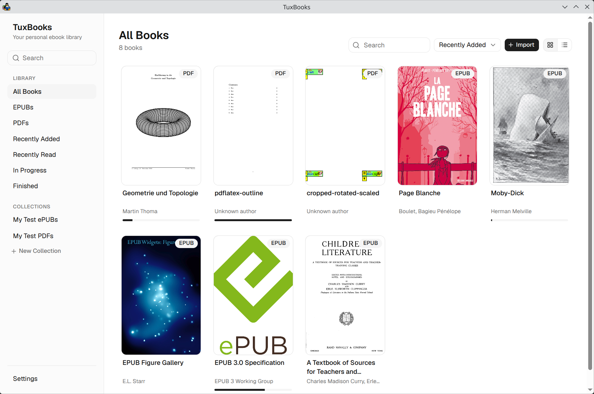

# TuxBooks

[](https://github.com/tuunanet/tuxbooks/actions/workflows/ci.yml)
[](https://github.com/tuunanet/tuxbooks/releases)
[](LICENSE.md)
[](docs/build.md)

A local-first, bookshelf-style desktop ebook library for Linux (Electron
desktop shell). Point it at a folder of EPUB and PDF files; it indexes
metadata and covers into a local SQLite database, keeps collections and reading
progress, and provides EPUB and PDF reading experiences.



## Stack

- **Desktop:** Electron (Chromium shell) with a Rust sidecar (tokio, serde,
  sqlx/SQLite, thiserror, proptest) speaking JSON-RPC over stdio
- **Frontend:** React 19, TypeScript (strict), Vite, Tailwind CSS 4, shadcn/ui
- **Testing:** Vitest + React Testing Library, Playwright Test
  (Playwright's Electron API), cargo test
- **Tooling:** pnpm, just, rustfmt, clippy, ESLint, Prettier, GitHub Actions

## Install

Prebuilt packages (deb, AppImage) are on the
[releases page](https://github.com/tuunanet/tuxbooks/releases) — TuxBooks is
pre-1.0, so releases are marked pre-release:

```sh
# Ubuntu/Debian
sudo apt install ./tuxbooks_<version>_amd64.deb
# Any other Linux — portable, no installation
chmod +x tuxbooks_<version>_amd64.AppImage && ./tuxbooks_<version>_amd64.AppImage
```

Verify downloads against `SHA256SUMS.txt` in the same release. See
[docs/release.md](docs/release.md) for how releases are cut and packaged.

## Getting started

Prerequisites: Node ≥ 22, pnpm 10, Rust (stable).

```sh
pnpm install
just dev        # Electron window with hot reload (Vite renderer + Rust sidecar)
just build      # release build (renderer, Electron main/preload, sidecar binary)
```

## Commands

| Command                | Does                                                                 |
| ---------------------- | -------------------------------------------------------------------- |
| `just dev`             | Run the app in dev mode (Vite + Electron + Rust sidecar, hot reload) |
| `just build`           | Release build: renderer, Electron main/preload, sidecar binary       |
| `just test`            | All unit tests (Rust + frontend, concurrently)                       |
| `just test-rust`       | `cargo test` (unit + integration + property tests)                   |
| `just test-frontend`   | Vitest in CI mode                                                    |
| `just test-e2e`        | Real-app desktop E2E — headless on Linux (Xvfb), no display needed   |
| `just test-e2e-headed` | Same E2E on your visible display (debugging)                         |
| `just lint`            | clippy (`-D warnings`) + ESLint + Electron typecheck                 |
| `just format`          | rustfmt + Prettier                                                   |
| `just check`           | format-check → lint → typecheck → tests (daily driver)               |

Individual pieces: `pnpm --filter frontend test`,
`cargo test --manifest-path sidecar/Cargo.toml`.

E2E needs the `xvfb` package (`sudo apt install xvfb` on Debian/Ubuntu).
`just test-e2e` is safe to run from SSH, CI, or anywhere without a desktop
session. See [docs/testing.md](docs/testing.md).

## Layout

```
frontend/          React app (presentation only)
electron/          Electron main + preload (bundled TypeScript)
sidecar/         Rust sidecar: rpc, commands, domain, services, repository, db, epub
sidecar/migrations/  SQLx migrations (embedded, run automatically)
e2e/               Playwright suites, environment bootstrap, watchdog
tests/fixtures/    committed test data (books/minimal.epub, books/minimal.pdf)
artifacts/e2e/     E2E failure artifacts (screenshots, logs; gitignored)
docs/              architecture, database, epub, pdf, testing, performance
scripts/           fixture/icon generators, build and fetch helpers, env helper
```

## Documentation

Start with [docs/architecture.md](docs/architecture.md), then
[docs/database.md](docs/database.md), [docs/epub.md](docs/epub.md), and
[docs/testing.md](docs/testing.md). Agents: read `AGENTS.md`
first.

## License

GPL-3.0-or-later — see [LICENSE.md](LICENSE.md).
